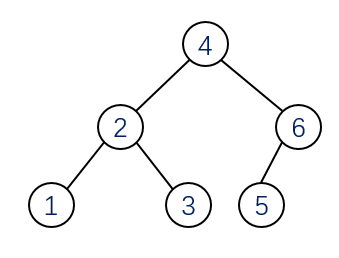
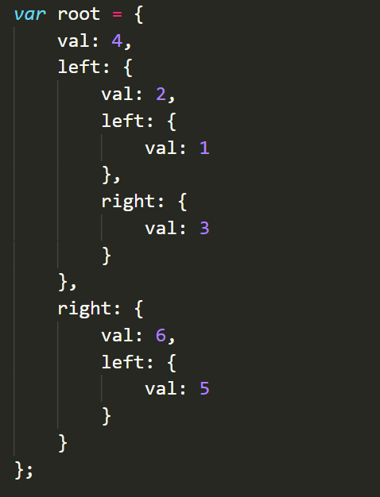
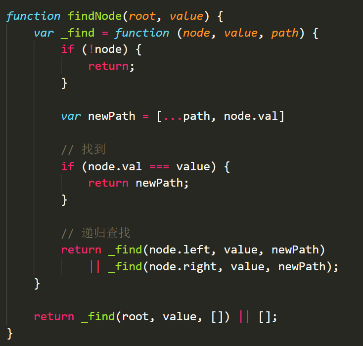
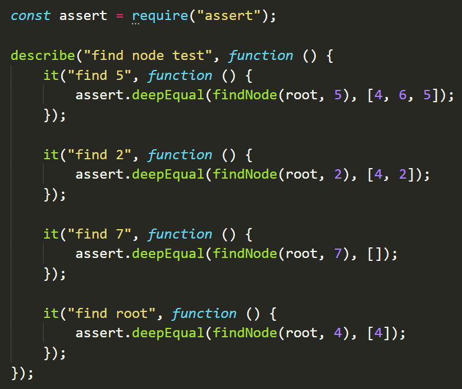
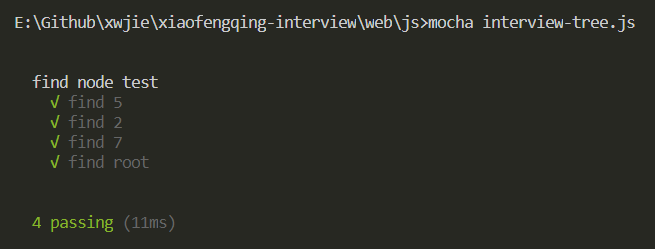

# 如何在细节上给面试官留下专业的好印象？

首先，面试是一个比较主观的过程，每一个面试官有自己的个性和看重点，有些面试官喜欢很能说的人，有些面试官不关注你说什么，而是和你扣技术细节。同样，同一个人在相同的面试难度题目中，不同的面试官给出的结果也会很不一样。有时候同一个面试官和相同的题目，你面试不通过，而比你技术差的人去面试却通过了？是不是很郁闷？

其实这些都说明了，面试是一个比较主观的交流过程，有时候一些细节能决定你结果成败。所以我们去面试的时候，要注意各个环节的细节，尽量给面试官留下好学、细致、勤奋、专业的技术特征。在这里我分享一次我前些时候做为面试官的经历，这次经历印象比较深刻，当时的面试者给我留下了很专业的好印象，当然最终给的评级也比较高了。

当时面试的是前台开发，按惯例先做一道JS的基础逻辑题目。难度中等，题目如下：

```
编写一个查找树节点的函数，输入树的根节点
和要查找的节点的值，返回根节点到该节点的
路径，如果找不到，返回[]。

树如下图。

举例：

输入5，返回[4,6,5]
输入2，返回[4,2]
输入7，返回[]
```

这里我们假设所有节点的值不会重复，不会为空。

树如图：



考虑到前台的数据结构能力偏弱，我给出了如何定义树的参考，可以直接copy来使用：



题目的难度对于后台来说是入门，对于前台来说是中等，大家有兴趣可以自己做一些。在所有面试者里面，做很好的做出来不到50%，不管多少年工作经验。不要小看了他的难度，实际的结果是大部分在提示下，花了近45-60分钟才勉强完成。大家可以先不要看下面的答案自己花30分钟做一下试试。（PS：这还是在用面试者自己的电脑编写，IDE提示、编译、调试这些都有的情况下。）

当时这位面试的同学，很快就做出来了，应该是我这么多次面试里面最快写完代码的，函数写完不到15分钟。由于印象深刻，他的答案我现在还能记起来。

面试者的答案：



整个过程基本上不需要调试，编码行云流水，一气呵成。看到这里，我已经露出了欣慰的笑容，代码简洁易读，耗时短，还使用了es6的一些新特性，这位同学将来必是国家的栋梁之才！到这个时候，他只是简单测试了一下，还没有说全部完成，我已经准备往下一个环节走了。


大家觉得这道题是不是就差不多了？如果大家觉得这样就可以给面试官留下一个Perfect的印象，还是太天真了。到这一步，能给面试官留下一个不错、中上的印象（毕竟题目不算很难），他接下来的操作，直接给我一个耳目一新的冲击，最终让我忍不住从内心给他点赞！


这位同学究竟做了什么骚操作呢？他写单元测试了！他用mocha（抹茶）框架进行了完整的测试！

测试代码如下：



为什么这一点会touch到我的heart呢？其实，做过开发的同学都知道，现实中真正能给自己代码做完整的单元测试的程序员并不多，更加不用说前台开发了！更加不要说是自发的！有相当一部分人做单元测试都是公司领导要求看指标的才做的，代码要写到能做细粒度的单元测试其实不是那么容易的。他自发编写js的单元测试用例并用现在流行的测试框架测试，这一点让我感觉到他是一个专业的程序员，编程素养一点不比后台的差！而且对于面试官来说，看框架的测试结果明显比看log方便，这也算你好我也好吧。

单元测试的结果截图：



是比看日志判断正确更加人性化吧！

说明一下，我们面试的时候是使用面试者自己的电脑，他的ide是vscode，本地只需要全局安装mocha框架（安装命令：`npm install --global mocha`）就可以直接运行测试。


总结一下，所谓细节决定成败，在其他条件一样的情况下，细节可能会让你有能收到更加好的结果。所以啊，大家后面面试写代码的时候，要注意细节，变量名、方法名、注释这些都要认真对待，不管前台后台还是python，也不管是否能做出来，单元测试先写上，不管怎样，姿势要对，最后真的做不出来就说太紧张了，嘿嘿。

今天是2021年元旦，晓风轻祝大家元旦快乐！！新的一年更多工资更少bug！

## 本章代码路径

[https://github.com/xwjie/xiaofengqing-interview/tree/master/web/js/interview-tree.js](https://github.com/xwjie/xiaofengqing-interview/tree/master/web/js/interview-tree.js)

欢迎加星加关注，持续更新。欢迎在github上提issue交流。

本文首发公众号 `晓风轻技术小站` ，扫码关注

- 公众号: xiaofengqingjava


- QQ群: 607679993


