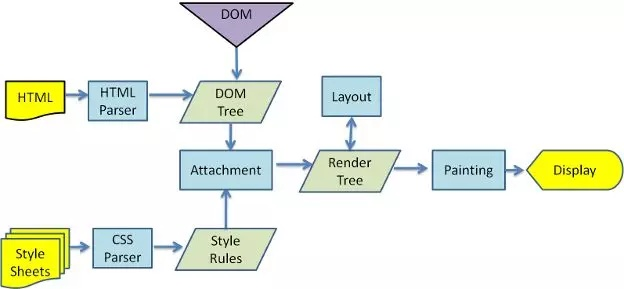
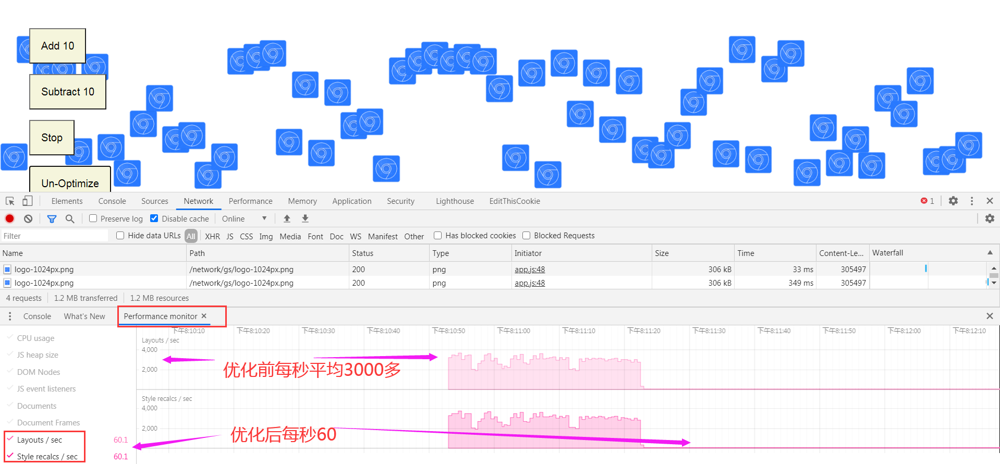

## 渲染




[分析关键渲染路径性能  |  Web  |  Google Developers](https://developers.google.com/web/fundamentals/performance/critical-rendering-path/analyzing-crp?hl=zh-cn)

## defer vs async

- defer 会 block DOMContentLoaded 事件，async不会
- 多个defer文件会顺序执行，async不会。


## 重排和重绘

[浏览器渲染详细过程：重绘、重排和 composite 只是冰山一角 - zzfx - 博客园](https://www.cnblogs.com/feng9exe/p/10907959.html)

- 官方demo

[Get Started With Analyzing Runtime Performance  |  Chrome DevTools](https://developers.google.com/web/tools/chrome-devtools/evaluate-performance)

offsetTop读写会引起重排/重绘

- 关键代码

```js
app.update = function (timestamp) {
    for (var i = 0; i < app.count; i++) {
      var m = movers[i];
      if (!app.optimize) {
        var pos = m.classList.contains('down') ?
            m.offsetTop + distance : m.offsetTop - distance;
        if (pos < 0) pos = 0;
        if (pos > maxHeight) pos = maxHeight;
        m.style.top = pos + 'px';
        if (m.offsetTop === 0) {
          m.classList.remove('up');
          m.classList.add('down');
        }
        if (m.offsetTop === maxHeight) {
          m.classList.remove('down');
          m.classList.add('up');
        }
      } else {
        var pos = parseInt(m.style.top.slice(0, m.style.top.indexOf('px')));
        m.classList.contains('down') ? pos += distance : pos -= distance;
        if (pos < 0) pos = 0;
        if (pos > maxHeight) pos = maxHeight;
        m.style.top = pos + 'px';
        if (pos === 0) {
          m.classList.remove('up');
          m.classList.add('down');
        }
        if (pos === maxHeight) {
          m.classList.remove('down');
          m.classList.add('up');
        }
      }
    }
    frame = window.requestAnimationFrame(app.update);
  }
```

- 优化前后重排和重绘次数对比。



- MVVM框架的虚拟Dom主要是避免多余的重排和重绘